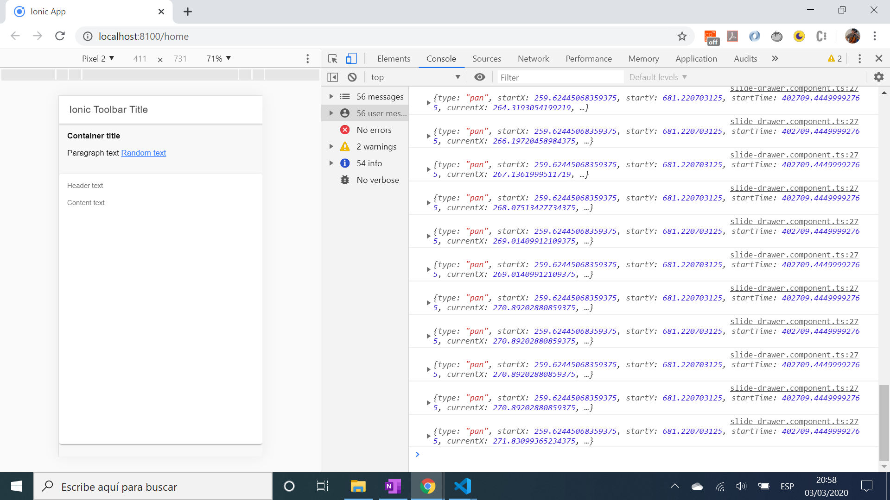

# :zap: Ionic Slide Drawer

* App to display a vertical slide drawer that raises to full height with an Ionic swipe Gesture, using the [Ionic framework](https://ionicframework.com/docs) and [Capacitor](https://capacitor.ionicframework.com/).
* Code from [Joshua Morony](https://www.youtube.com/channel/UCbVZdLngJH6KOJvpAOO3qTw) - see [:clap: Inspiration](#clap-inspiration) below
* **Note:** to open web links in a new window use: _ctrl+click on link_


* [:zap: Ionic Slide Drawer](#zap-ionic-slide-drawer)
  * [:books: General info](#books-general-info)
  * [:camera: Screenshots](#camera-screenshots)
  * [:signal\_strength: Technologies](#signal_strength-technologies)
  * [:floppy\_disk: Setup](#floppy_disk-setup)
  * [:computer: Code Examples](#computer-code-examples)
  * [:cool: Features](#cool-features)
  * [:clipboard: Status \& To-do list](#clipboard-status--to-do-list)
  * [:clap: Inspiration](#clap-inspiration)
  * [:file\_folder: License](#file_folder-license)
  * [:envelope: Contact](#envelope-contact)

## :books: General info

* Updated to the latest Angular & Ionic versions, all dependencies updated
* Uses [Ionic Gestures](https://ionicframework.com/docs/v3/components/#gestures) to activate drawer

## :camera: Screenshots



## :signal_strength: Technologies

* [Ionic/angular v6](https://ionicframework.com/)
* [Ionic v6](https://ionicframework.com/)
* [Angular v15](https://angular.io/)
* [Ionic Gestures](https://ionicframework.com/docs/utilities/gestures)

## :floppy_disk: Setup

* Load dependencies using `npm i`,
* To start the server on _localhost://8100_ type: `ionic serve`

## :computer: Code Examples

* extract from slide-drawer.component.ts: options: GestureConfig

```typescript
/*if gesture pulls drawer up more than 200px then drawer is raised all the way to the top of the ion-card-content (500px)
Note: Y axis is 0 at top and positions below 0 are negative values.*/
onEnd: ev => {
  this.renderer.setStyle(
    this.element.nativeElement,
    'transition',
    '0.3s ease-out'
  );

  if(ev.deltaY < -200) {
    this.renderer.setStyle(
      this.element.nativeElement,
      'transform',
      `translateY(-450px)`
    );
  } else {
    this.renderer.setStyle(
      this.element.nativeElement,
      'transform',
      `translateY(0px)`
    );
  }
}
```

## :cool: Features

* Uses a swipe gesture to open a drawer. Custom gestures and interactions can be created.

## :clipboard: Status & To-do list

* Status: working.
* To-do: nothing.

## :clap: Inspiration

* [Joshua Morony Youtube video: SLIDE DRAWER WITH IONIC GESTURES - Ionic UI Challenge #3](https://www.youtube.com/watch?v=AW80XVSOLZg&t=28s).
* [Josh Morony website](https://www.joshmorony.com/)

## :file_folder: License

* N/A

## :envelope: Contact

* Repo created by [ABateman](https://github.com/AndrewJBateman), email: gomezbateman@yahoo.com
